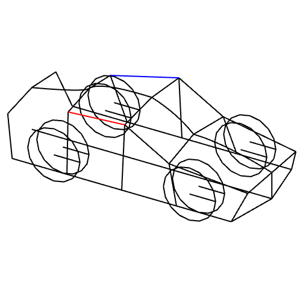

# construct
A library for higher order functional programming with homotopy maps to construct 3D geometry



### What is a homotopy map?

A [homotopy](https://en.wikipedia.org/wiki/Homotopy) is a continuous deformation between two functions. Think about combining two functions `f` and `g` with a parameter in the range between 0 and 1 such that setting the parameter to 0 gives you `f` and setting it to 1 gives you `g`. With other words, it lets you interpolate smoothly between functions.

This library uses a simplified homotopy version designed for constructing 3D geometry:

```rust
/// A function of type `1d -> 3d`.
pub type Fn1<T> = Arc<Fn(T) -> [T; 3] + Sync + Send>;
/// A function of type `2d -> 3d`.
pub type Fn2<T> = Arc<Fn([T; 2]) -> [T; 3] + Sync + Send>;
/// A function of type `3d -> 3d`.
pub type Fn3<T> = Arc<Fn([T; 3]) -> [T; 3] + Sync + Send>;
```

In this library, these functions are called *homotopy maps* and usually satisfies these properties:

- All inputs are assumed to be normalized, starting at 0 and ending at 1. This means that `Fn1` forms a curved line, `Fn2` forms a curved quad, and `Fn3` forms a curved cube.
- The `Arc` smart pointer makes it possible to clone closures.
- The `Sync` and `Send` constraints makes it easier to program with multiple threads.
- Basic geometric shapes are continuous within the range from 0 to 1.

A curved cube does not mean it need to look like a cube. Actually, you can create a variety of shapes that do not look like cubes at all, e.g. a sphere. What is meant by a "curved cube" is that there are 3 parameters between 0 and 1 controlling the generation of points. If you used an identity map, you would get a cube shape. The transformation to other shapes is the reason it is called a "curved cube".

### Motivation

Constructing 3D geometry is an iterative process where the final design/need can be quite different from the first draft. In game engines there are additional needs like generating multiple models of various detail or adjusting models depending on the capacity of the target platform. This makes it desirable to have some tools where one can work with an idea without getting slowed down by a lot of technical details.

Homotopy maps have the property that the geometry can be constructed by need, without any additional instructions. This makes it a suitable candidate for combining them with higher order functional programming. Functions give an accurate representation while at the same time being lazy, such that one can e.g. intersect a curved cube to get a curved quad.

This library is an experiment to see how homotopy maps and higher order functional programming can be used to iterate on design. Function names are very short to provide good ergonomics.
